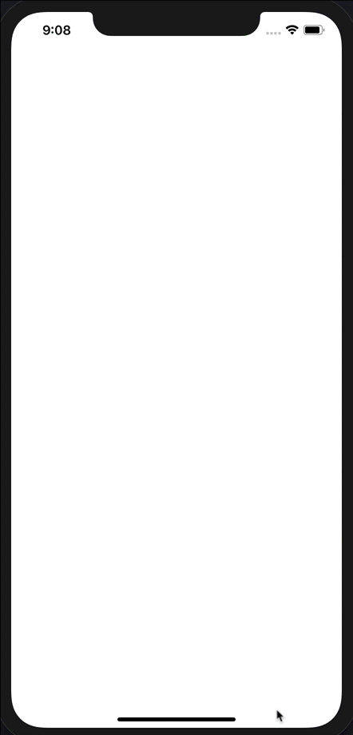

# react-native-swipeable-list

[](https://badge.fury.io/js/react-native-swipeable-list)


A Swipeable FlatList for React-Native with Quick Actions &amp; Animations



## Usage

1. Install the package in your project:

`npm install react-native-swipeable-list`

or

`yarn add react-native-swipeable-list`

2. Import the component into your component:

`import SwipeableFlatList from 'react-native-swipeable-list';`

3. Pass it a data array. It inherits [FlatListProps from the standard `FlatList` component from react-native](https://facebook.github.io/react-native/docs/flatlist).

It can be passed other props:

    - To alert the user that swiping is possible, the first row can bounce on component mount. It's defaulted to true.
    ```shouldBounceOnMount: boolean```

    - Maximum distance to open to after a swipe
    ```maxSwipeDistance: number || (Object => number)```

    - Callback method to render the view that will be unveiled on swipe
    ```renderQuickActions: renderItemType```

## Example

Check out the example in the `/examples` folder. Clone this repo, then `cd examples && yarn install && yarn start` and then either  `react-native run-ios` or `react-native run-android` to get the app up and running locally. Play with the code and see what you can do.

## History & Shoutouts

Started from the `SwipeableFlatList` component that was removed from react-native's experimental libraries. (See: https://github.com/facebook/react-native/commit/9ca7989f60cc8137705effeaad0f128fa73ed2e4)
